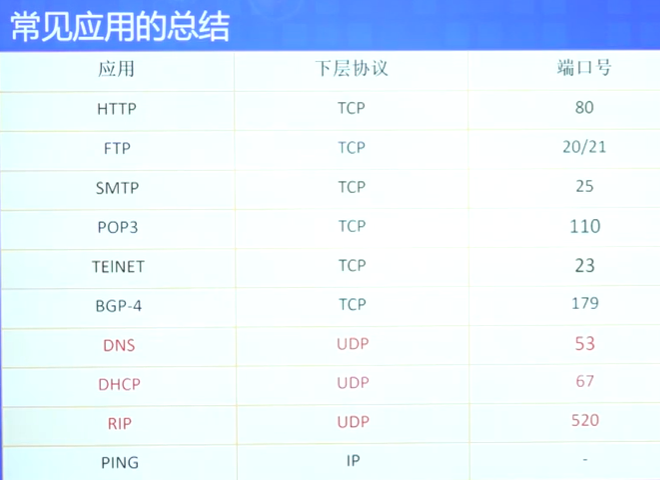

# 应用层

应用层是为了解决某一类问题而设立的，其具体内容是规定应用进程在通信时所遵守的协议。许多协议都是基于客户服务器模式，描述了进程之间服务和被服务的关系（客户是服务请求方，服务器是服务提供方）。  

具体应用包含有：域名解析DNS，文件传输FTP，电子邮件Email，万维网WWW，动态主机配置DHCP，建立在FTP的电子邮件SMTP，远程主机TELNET

## DNS

域名到IP地址的解析由域名解析服务器完成的（域名 -> IP映射），域名服务器程序在专设的节点上运行，运行该程序的机器称为域名服务器。  
域名分为不同的层级，从根到顶级域名、二级域名、三级域名、四级域名...，呈现树形结构。

**域名服务器**：一个服务器负责管辖的范围叫区zone。  
域名服务器也是分层的，从根域名服务器到顶级域名服务器、权限域名服务器。

      根域名服务器是最高层次的、最重要的域名服务器，所有跟域名服务器都知道所有的顶级域名服务器域名和IP地址。任何本地域名服务器解析任一域名时若无法自己解析，就首先求助于根域名服务器。
      顶级域名服务器负责挂你该顶级域名服务器的所有二级域名。收到DNS查询请求时就给出相应回答（可能是最后结果，也可能是下一步应当找的域名服务器的IP地址）。
      权限域名服务器负责一个区的域名服务器，当权限域名服务器还不能给出最后查询回答时，就会告诉DNS客户下一步应当找拿一个权限域名服务器。
      本地域名服务器也被叫做默认域名服务器，对域名系统很重要，一个主机发出DNS查询请求时，该查询请求报文就发送给本地域名服务器。

每个域名服务器都维护一个高速缓存来存放最近用过的名字和从何处获得名字映射信息的纪录，用以提高可靠性和速度。

DNS解析类型包括：  
迭代解析（本地DNS有缓存时，最少0次 最多N次；无缓存时，最少1次 最多N次）；  
递归解析（本地DNS有缓存时，最少0次 最多1次；无缓存时，最少1次 最多1次）。

## FTP

互联网上最广泛使用的文件传送协议，提供交互式访问，允许客户知名文件类型并允许文件具有存取权限。FTP屏蔽了计算机系统的细节，适用于异构网络中任意计算机间传送文件。  
屏蔽了计算机存储数据的格式不同、屏蔽文件目录结构和文件命名的规定不同、冰壁操作系统使用命令不同、屏蔽访问控制方法不同。  

FTP使用客户服务器模式，一个FTP服务器进程可同时为多个客户服务。

**FTP的两个连接**：  
*控制连接*在整个会话期间一直保持打开，FTP客户发出传送请求通过控制链接发送给服务器端的控制进程。  
*数据连接*用于实际的传送文件，服务器端的控制进程接收到FTP客户发来文件传输请求后就创建“数据传送进程”和“数据连接”，连接客户端和服务器端的数据传送进程。

**FTP的两个端口**：  
在客户进程向服务器进程发出建立连接请求时寻找*熟知端口21*，并向服务器进程告诉自己的另一个端口号，用于建立连接。  
接着服务器进程用自己传送数据的*熟知端口20*与客户进程提供的端口号建立数据传送连接。  
21是控制端口，20是数据端口（主动模式下）。在被动模式时由服务器端和客户端协商而定。

## WWW

能够让web客户端浏览访问web服务器上页面的应用。万维网是超分布式超媒体系统，是超文本系统的扩展。
WWW的特性是：统一资源定位符URL，超文本传送协议HTTP，万维网的文档，万维网的信息检索系统。

**URL**：对从互联网上得到资源的位置和访问方式的一种简介表示。URL给资源位置提供一种抽象识别方法，并用这种方法给资源定位。其一般格式为（其中主机位存放资源的主机）：  
`<协议>://<主机>:<端口>/<路径>`

**HTTP**：万维网客户程序和服务器程序间进行交互使用的协议。协议本身是无连接的，但借助了TCP协议的80端口进行可靠传输。面向事务的客户服务器协议，HTTP1.0协议是无状态的。  
**工作流程**：  
浏览器分析超链指向页面的URL，向DNS请求解析域名IP地址；DNS解析出IP地址；浏览器与服务器建立TCP连接，发出取文件命令；服务器给出相应，把文件发送给浏览器；TCP释放连接；浏览器显示文件中的所有内容。  
**HTTP连接的两种方式**：  
非持续性连接（每个请求/响应都是经一个单独TCP连接发送）：`(n+1) * RRT`；  
持续性连接（所有请求/响应都用相同TCP连接发送）：`2n * RRT`。

## Email

电子设备交换的邮件及其方法。包括用户代理，邮件服务器，以及邮件发送和读取协议。  
电子邮件基于TCP连接，通过SMTP发送邮件。

相关Email协议：

1. **MIME**：用于电子邮件的标准，它扩展了原始的文本邮件格式，支持多种字符集和各种附件，使其传输和呈现多种类型的数据
2. **SMTP**：*发送*电子邮件的标准协议。使用客户端-服务器模型，邮件客户端通过与邮件服务器建立连接，将邮件发送到目标服务器，然后由目标服务器将邮件传递给接收方的邮件服务器。但SMTP不能传送可执行文件或其它二进制对象，限于传送7位的ASCII码，SMTP会拒绝超过一定长度的邮件
3. **POP3**：*接收*电子邮件的协议。将邮件从邮件服务器下载到本地设备，并在下载后将邮件从服务器上删除。常用于单个设备上的简单邮件访问，不支持多个设备同步邮件状态
4. **IMAP**：*接收*电子邮件的协议。与POP3不同，IMAP允许用户在邮件服务器上管理和组织邮件，不仅仅是将邮件下载到本地。支持在多个设备同步邮件状态

## DHCP

互联网广泛使用的动态主机配置协议，提供了即插即用的联网机制，允许一台计算机加入新的网络和获取IP地址，而非手工配置。  
需要IP地址的主机在启动时想DHCP服务器广播发送发现报文DHCPDISCOVER，主机称为DHCP客户，本地网络上所有主机都能收到报文，但只有DHCP服务器才能回答此报文。  

## 补充

- DNS查询通常用UDP协议
- 采用迭代解析比递归解析更能减轻DNS服务器压力，也因此互联网上的计算机普遍采用此策略
- 在递归查询中，若本地域名服务器不知道被查询域名的IP地址，则会以DNS客户身份向其它根域名服务器发出请求报文
- 从FTP服务器下载文件时，FTP服务器对数据进行封装的五个转换步骤是：数据，数据段，数据包，数据帧，比特
- FTP中的数据连接会在整个会话期间保持打开状态
- WWW中的超文本标记语言HTML属于OSI协议体系中的表示层
